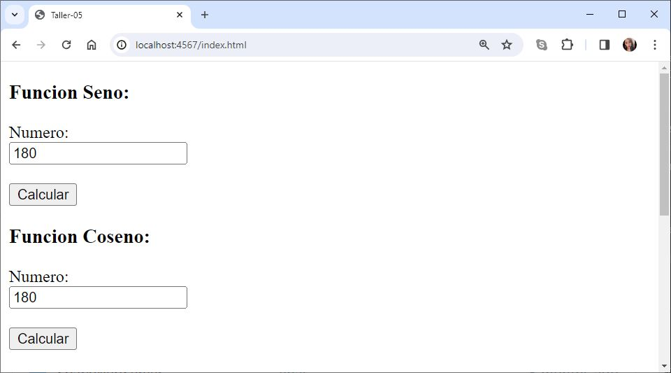
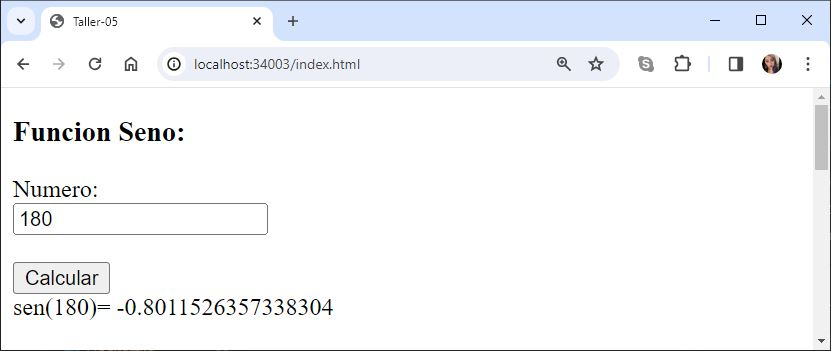
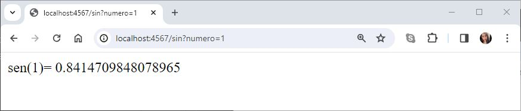
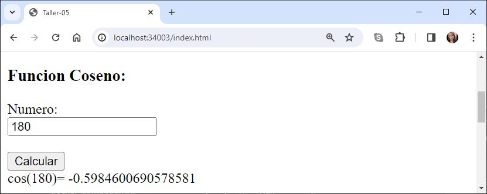
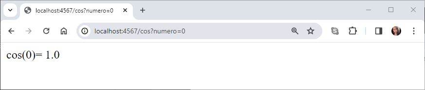
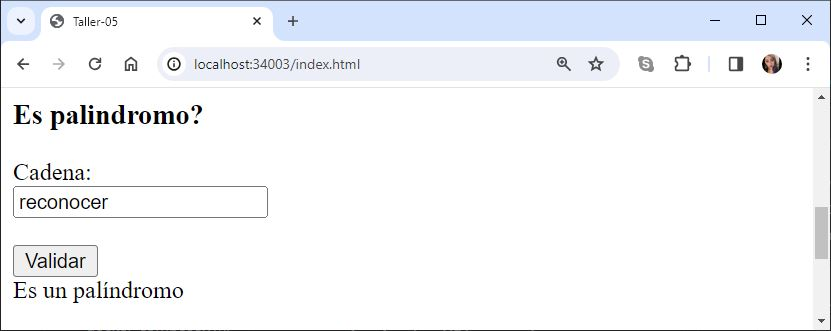
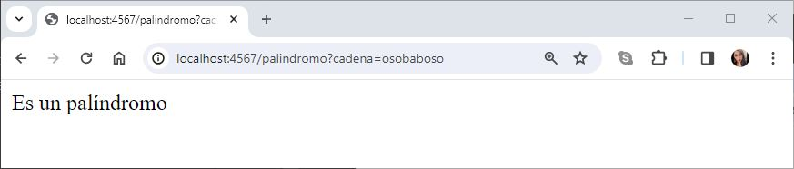
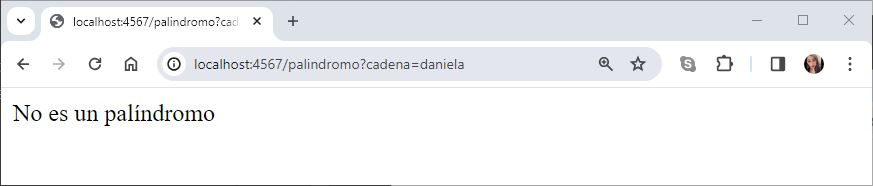
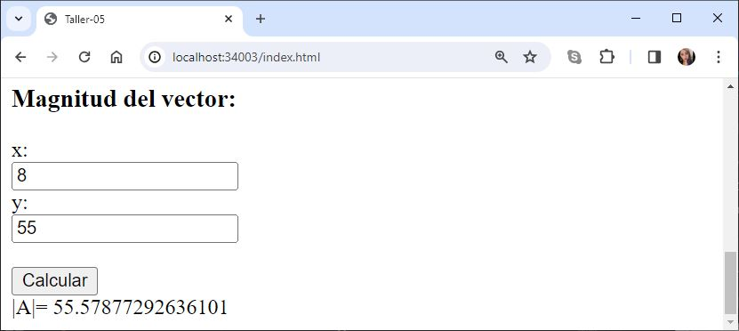
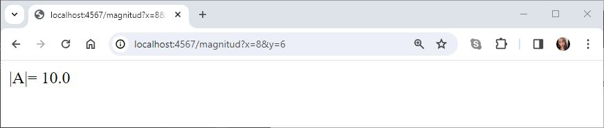

# TALLER 5: Modularización con virtualización e introducción a Docker

Se creo una aplicación web pequeña usando el micro-framework de Spark java (http://sparkjava.com/). Luego de esto se construyó un container para docker para la aplicación, los desplegamos y configuramos en nuestra máquina local. Adicional a esto se creó un repositorio en DockerHub y subimos la imagen al repositorio. 

Esta aplicación nos proporciona formularios en donde se puede calcular el seno y coseno de un número, indica si una palabra es palíndrome y calcula la magnitud real de un vector de dos dimensiones.


---
### Prerrequisitos

* [Maven](https://maven.apache.org/): Es una herramienta de comprensión y gestión de proyectos de software. Basado en el concepto de modelo de objetos de proyecto (POM), Maven puede gestionar la construcción, los informes y la documentación de un proyecto desde una pieza de información central.

* [Git](https://learn.microsoft.com/es-es/devops/develop/git/what-is-git): Es un sistema de control de versiones distribuido, lo que significa que un clon local del proyecto es un repositorio de control de versiones completo. Estos repositorios locales plenamente funcionales permiten trabajar sin conexión o de forma remota con facilidad.

* [Docker](https://aws.amazon.com/es/docker/): Es una plataforma de software que le permite crear, probar e implementar aplicaciones rápidamente. Docker empaqueta software en unidades estandarizadas llamadas contenedores que incluyen todo lo necesario para que el software se ejecute, incluidas bibliotecas, herramientas de sistema, código y tiempo de ejecución.

* [DockerHub](https://flexa.cloud/es/%C2%BFQu%C3%A9-es-el-centro-de-la-ventana-acoplable%3F/): Es un repositorio público de imágenes de contenedores, donde muchas empresas e individuos pueden publicar imágenes de soluciones prediseñadas.

* [Docker Desktop](https://www.docker.com/products/docker-desktop/): Es una aplicación de escritorio que proporciona una experiencia unificada para desarrollar, implementar y administrar aplicaciones en contenedores Docker en sistemas operativos Windows y macOS.

---

### Instalación

1.Clonamos el repositorio

```
https://github.com/AREP2024-1/AREP_Taller05.git
```

2.Ingresamos a la carpeta del repositorio que clonamos anteriormente

```
cd AREP_Taller05
```

3.Contruimos el proyecto

```
mvn package
```

---

### Ejecución

1.Levantamos el servidor

***Windows:***

```
mvn exec:java -"Dexec.mainClass"="edu.eci.arep.ASE.app.SparkWebServer" 
```

***MacOs y Linux:***

```
mvn exec:java -Dexec.mainClass="edu.eci.arep.ASE.app.SparkWebServer" 
```


2.Probamos nuestra aplicación accediendo a la siguiente URL en el navegador
```
http://localhost:4567/index.html
```


---
### Ejecución Docker

1.Descargamos la imagen


```
docker pull danielaladino/firstsprkwebapprepo:latest
```

2.Corremos la imagen

```
docker run -d -p 34003:46000 --name container danielaladino/firstsprkwebapprepo
```

3.Probamos nuestra aplicación accediendo a la siguiente URL en el navegador
```
http://localhost:34003/index.html
```


---

### Casos de uso

**1. Seno:**


```
http://localhost:4567/sin?numero=1
```


**2. Coseno:**


```
http://localhost:4567/cos?numero=0
```


**3. Palindromo:**


```
http://localhost:4567/palindromo?cadena=osobaboso
```


```
http://localhost:4567/palindromo?cadena=daniela
```


**4. Magnitud vector:**


```
http://localhost:4567/magnitud?x=8&y=6
```


---
### Ejecución de Test

Ejecutamos el siguiente comando

```
mvn test 
```

---
### Arquitectura
**Back-end**
* ***SparkWebServer***: La clase SparkWebServer es un componente fundamental de una aplicación web que emplea el framework Spark para Java. Esta clase se encarga de gestionar las solicitudes HTTP y proporcionar respuestas apropiadas según las rutas especificadas. Al ejecutar la aplicación, el método main configura el servidor para escuchar en un puerto determinado y define las rutas disponibles, tales como /hello, /sin, /cos, /palindromo y /magnitud. Cada una de estas rutas realiza operaciones específicas, como cálculos matemáticos o verificaciones de cadenas. Además de las rutas, la clase incluye métodos auxiliares como calcularSeno, calcularCoseno, esPalindromo y magnitudVector para realizar los cálculos necesarios.

**Front-end**

* ***index.html***: Formulario de la aplicación con cada una de las funcionalidades. 
* ***index.js***:Contiene la lógica de la interacción del cliente.

---

### Construido con

* [Maven](https://maven.apache.org/): Es una herramienta de comprensión y gestión de proyectos de software. Basado en el concepto de modelo de objetos de proyecto (POM), Maven puede gestionar la construcción, los informes y la documentación de un proyecto desde una pieza de información central.

* [Git](https://learn.microsoft.com/es-es/devops/develop/git/what-is-git): Es un sistema de control de versiones distribuido, lo que significa que un clon local del proyecto es un repositorio de control de versiones completo. Estos repositorios locales plenamente funcionales permiten trabajar sin conexión o de forma remota con facilidad.

* [GitHub](https://platzi.com/blog/que-es-github-como-funciona/): Es una plataforma de alojamiento, propiedad de Microsoft, que ofrece a los desarrolladores la posibilidad de crear repositorios de código y guardarlos en la nube de forma segura, usando un sistema de control de versiones llamado Git.

* [Java -8](https://www.cursosaula21.com/que-es-java/): Es un lenguaje de programación y una plataforma informática que nos permite desarrollar aplicaciones de escritorio, servidores, sistemas operativos y aplicaciones para dispositivos móviles, plataformas IoT basadas en la nube, televisores inteligentes, sistemas empresariales, software industrial, etc.

* [JavaScript](https://universidadeuropea.com/blog/que-es-javascript/): Es un lenguaje de programación de scripts que se utiliza fundamentalmente para añadir funcionalidades interactivas y otros contenidos dinámicos a las páginas web.

* [HTML](https://aulacm.com/que-es/html-significado-definicion/): Es un lenguaje de marcado de etiquetas que se utiliza para crear y estructurar contenido en la web. Este lenguaje permite definir la estructura y el contenido de una página web mediante etiquetas y atributos que indican al navegador cómo mostrar la información.

* [Visual Studio Code](https://openwebinars.net/blog/que-es-visual-studio-code-y-que-ventajas-ofrece/): Es un editor de código fuente desarrollado por Microsoft. Es software libre y multiplataforma, está disponible para Windows, GNU/Linux y macOS.

* [Docker](https://aws.amazon.com/es/docker/): Es una plataforma de software que le permite crear, probar e implementar aplicaciones rápidamente. Docker empaqueta software en unidades estandarizadas llamadas contenedores que incluyen todo lo necesario para que el software se ejecute, incluidas bibliotecas, herramientas de sistema, código y tiempo de ejecución.

## Autor

* **[Karol Daniela Ladino Ladino](https://www.linkedin.com/in/karol-daniela-ladino-ladino-55164b272/)** - [20042000](https://github.com/20042000)


## Licencia
**©** Karol Daniela Ladino Ladino. Estudiante de Ingeniería de Sistemas de la Escuela Colombiana de Ingeniería Julio Garavito

